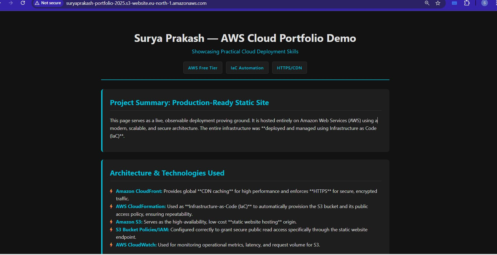
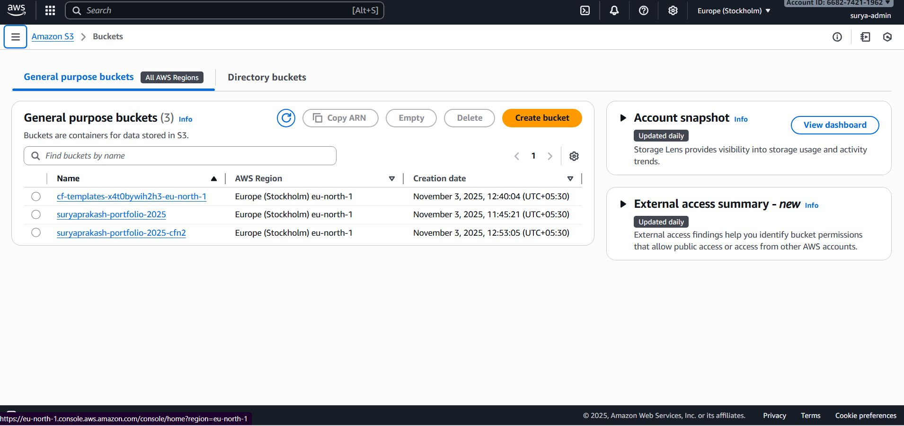
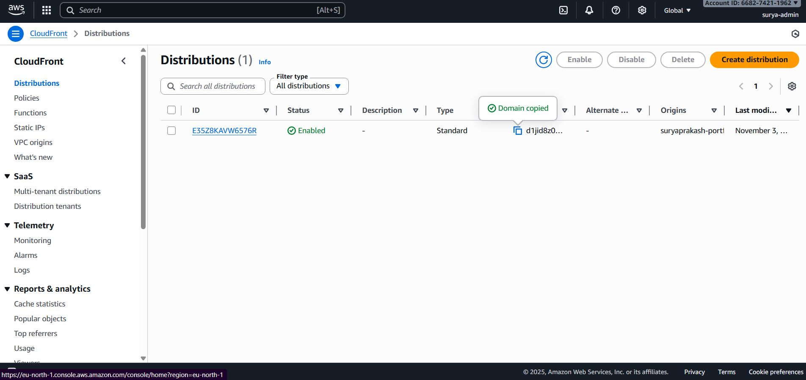
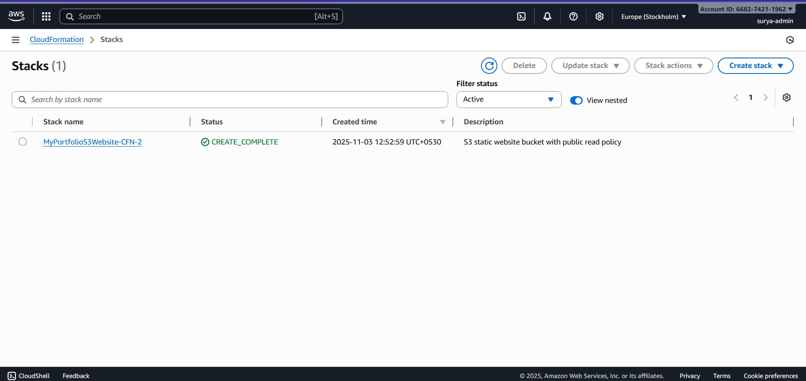

# AWS Static Website + CloudFront + CloudFormation (IaC)

This project shows how I deployed a fully functional static website using AWS with proper architecture and automation.

---

## 📸 Screenshots

### 🔹 Final Live Website Preview

### 🔹 S3 Bucket Setup

### 🔹 CloudFront Setup

### 🔹 CloudFormation Stack Status

---

## 🏗️ Architecture & Tools Used

This project uses:

- **Amazon S3** for static website hosting  
- **AWS CloudFront** as global CDN + HTTPS  
- **AWS CloudFormation** (YAML) for Infrastructure as Code  
- **IAM & S3 Policies** for secure access  
- Basic monitoring using AWS metrics

---

## 🧠 What I Learned

✔ Hosting static content using S3  
✔ Configuring CloudFront for HTTPS and caching  
✔ Writing reproducible infrastructure with CloudFormation  
✔ Creating secure bucket policies and IAM access  
✔ Deploying AWS resources using best practices

